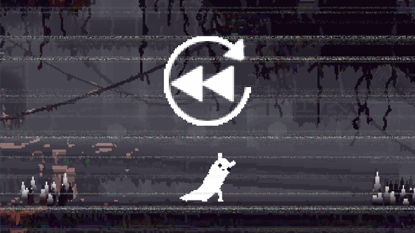

# Instant Replay
  
Rain World Instant Replay

This is a mod for the game Rain World that lets you rewind (visually) up to 20 seconds at any moment allowing you to easily re-experience chaotic moments and analyze them.  
The mod is usable in all modes (Story/Arena and Expiditon mode) and highly configurable.

##### With the default keybinds the mod can be used in the following way:  
Press '__I__' to open instant replay, it will now play the last X seconds starting at the beginning of the recording.  
You can toggle between fullscreen and popup mode with the '__F__' key while the player is active.  
While the replayer is open you can pause with the '__P__' key or by pressing either the __right or left arrow key__. Press '__P__' again to enter play mode.  
The current state (playing/paused) is indicated via an icon in the top right of the player.   
Using the arrow keys you can now go forward (right arrow key) and backwards (left arrow key). Tapping a key shortly will go frame by frame while holding will fast forward/rewind.  
By pressing the '__E__' key the current frame will be exported as .png to the part defined in the options menu (defaults to "Rain World" folder in your pictures folder).  
